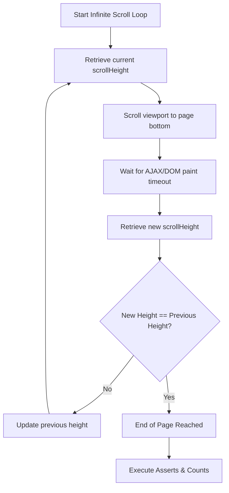

# Mouse Actions & Scrolling

In modern web automation, UI interactions frequently extend beyond simple left clicks. Dropdowns require hovering to trigger flyout submenus, complex canvas layouts or node editors require drag-and-drop operations, and modern data-rich interfaces rely on scroll containers or infinite scroll feeds. 

Playwright provides elegant APIs to emulate precise mouse dynamics and scroll events, backed by built-in auto-scrolling guarantees.

---

## 1. Playwright Autoscrolling & Actionability

One of Playwright's most powerful features is **Actionability Checks**. Before performing actions like `.click()`, `.hover()`, `.check()`, or `.fill()`, Playwright automatically checks that the target element is:
1. **Attached** to the DOM.
2. **Visible** on the viewport.
3. **Stable** (not animating or changing layout coordinates).
4. **Receiving Pointer Events** (not covered by overlays).
5. **Enabled** (not disabled in HTML).

As part of this actionability lifecycle, **Playwright automatically scrolls the element into view** if it is not already visible. This means you rarely need to execute explicit scroll commands for standard inputs.

:::tip How Autoscrolling Works Under the Hood
When an action is called on a locator, Playwright utilizes the browser engine to scroll the page container until the target element intersects the viewport boundaries. If the element is within a scrollable `div` or sub-frame, Playwright scrolls that specific nested container.
:::

### Code Examples: Autoscrolling Scenarios

```typescript
import { test, expect } from '@playwright/test';

test('Autoscrolling to Footer Elements', async ({ page }) => {
  await page.goto('https://demowebshop.tricentis.com/');
  
  // The footer disclaimer is located far below the fold. 
  // Calling .innerText() triggers automatic scrolling.
  const footerText = await page.locator('.footer-disclaimer').innerText();
  console.log("Footer text captured:", footerText);
  expect(footerText).toContain('Tricentis');
});

test('Scrolling Inside Nested Dropdown Containers', async ({ page }) => {
  await page.goto('https://testautomationpractice.blogspot.com/');

  await page.locator("#comboBox").click();
  
  // Target a deep child item inside the combo box container.
  // Playwright scrolls the dropdown list view to reach the item.
  const option = page.locator('#dropdown div:nth-child(100)');
  console.log("Option captured from Dropdown:", await option.innerText());
  await option.click();
});

test('Vertical & Horizontal Scrolling Inside Scrollable Grid Tables', async ({ page }) => {
  await page.goto('https://datatables.net/examples/basic_init/scroll_xy.html');

  // Vertical scroll to the 10th row
  const name = await page.locator('tbody tr:nth-child(10) td:nth-child(2)').innerText();
  console.log("Name from 10th Row & 2nd Column:", name); // Kelly

  // Horizontal scroll to the 9th column (Email address)
  const email = await page.locator('tbody tr:nth-child(10) td:nth-child(9)').innerText();
  console.log("Email from 10th Row & 9th Column:", email); // c.kelly@datatables.net
});
```

---

## 2. Advanced Mouse Operations

When simulating complex human workflows, you must use specialized pointer actions. Playwright provides dedicated methods on the `Locator` object for hovering, double clicking, and right clicking.

| Mouse Event | Playwright Locator API | Description | Common Use Case |
| :--- | :--- | :--- | :--- |
| **Hover** | `await locator.hover()` | Positions the pointer over the bounding box of the element. | Expanding flyout dropdowns or tooltips. |
| **Right Click** | `await locator.click({ button: 'right' })` | Fires a click event with the secondary mouse button. | Accessing custom context menus. |
| **Double Click** | `await locator.dblclick()` | Fires two quick sequential click events on the target locator. | Editing text fields in-place or selecting values. |

### Code Examples: Hover, Double Click, and Right Click

```typescript
import { test, expect } from '@playwright/test';

test('Mouse Hover Navigation Chain', async ({ page }) => {
  await page.goto('https://testautomationpractice.blogspot.com/');

  const pointMeButton = page.locator('.dropbtn');
  await pointMeButton.hover(); // Reveals the dropdown content menu

  const laptopMenuLink = page.locator('.dropdown-content a:nth-child(2)');
  await laptopMenuLink.hover(); // Hovers nested sub-link
});

test('Context-Menu Right Click', async ({ page }) => {
  await page.goto('http://swisnl.github.io/jQuery-contextMenu/demo.html');

  const contextButton = page.locator('span.context-menu-one');
  
  // Trigger right-click to open context menu
  await contextButton.click({ button: 'right' });
  
  // Verify that context menu popup list is visible
  await expect(page.locator('.context-menu-list')).toBeVisible();
});

test('Double Click Field Value Duplication', async ({ page }) => {
  await page.goto('https://testautomationpractice.blogspot.com/');

  const doubleClickButton = page.locator("button[ondblclick='myFunction1()']");
  
  // Double-clicking copies text from Field 1 to Field 2
  await doubleClickButton.dblclick();

  const destinationField = page.locator('#field2');
  await expect(destinationField).toHaveValue('Hello World!');
});
```

---

## 3. Drag and Drop Automation

Drag-and-drop operations involve clicking a source element, dragging it across the screen, and releasing it over a target drop zone. Playwright offers two distinct patterns to automate this process.

### Approach A: Direct Helper API (Recommended)
The direct `locator.dragTo()` helper automatically resolves the coordinates of both elements, hovers over the source, clicks and holds, moves the pointer to the target, and releases it.

```typescript
await sourceLocator.dragTo(targetLocator);
```

### Approach B: Manual Pointer Emulation (Low-Level Mouse API)
If the page relies on complex drag events that require a hover pause before movement, you can manually orchestrate individual pointer actions using `page.mouse`:

```typescript
await sourceLocator.hover();
await page.mouse.down();
await targetLocator.hover();
await page.mouse.up();
```

---

### Hands-on Lab: Drag and Drop Scenarios

Here is how you handle multiple drag-and-drop actions on a page (e.g., matching debit/credit account boxes and numerical prices on Guru99):

```typescript
import { test, expect } from '@playwright/test';

test('Multi-Target Drag and Drop Lab', async ({ page }) => {
  await page.goto('https://demo.guru99.com/test/drag_drop.html');

  // Define Locators for Accounts
  const bankBlock = page.locator('#credit2 a');          // Source: BANK
  const bankAccountZone = page.locator('#bank li');      // Target: Debit Account

  const salesBlock = page.locator('#credit1 a');         // Source: SALES
  const salesAccountZone = page.locator('#loan li');     // Target: Credit Account

  // Define Locators for Amounts (Prices)
  const debitAmount500 = page.locator('#fourth a').first(); // Source: 1st 500 block
  const debitAmountZone = page.locator('#amt7 li');         // Target: Debit Amount

  const creditAmount500 = page.locator('#fourth a').nth(1); // Source: 2nd 500 block
  const creditAmountZone = page.locator('#amt8 li');        // Target: Credit Amount

  // Execute Drag Operations using Direct Helper API
  await bankBlock.dragTo(bankAccountZone);
  await salesBlock.dragTo(salesAccountZone);
  await debitAmount500.dragTo(debitAmountZone);
  await creditAmount500.dragTo(creditAmountZone);

  // Assert successful table validation
  const perfectBanner = page.locator('a:has-text("Perfect!")');
  await expect(perfectBanner).toBeVisible();
});
```

---

## 4. Infinite Scroll Automation

An **Infinite Scroll** layout dynamically queries the backend and appends rows or grid items as the viewport nears the bottom of the page. Because these elements do not exist in the DOM on initial page load, standard locators will fail to locate them until scrolling occurs.

To automate infinite scrolling in Playwright, we implement an **evaluation loop** that repeatedly scrolls to the page height limit, waits for content to load, and checks if new content was appended by comparing heights.



### Key Scrolling Methods
1. **JavaScript Evaluation**:
   ```typescript
   await page.evaluate(() => window.scrollTo(0, document.body.scrollHeight));
   ```
2. **Keyboard Emulation**:
   ```typescript
   await page.keyboard.press('End');
   ```

> [!WARNING] Handling Page Load Timeouts
> Dynamic scrolling loops are time-intensive and can easily trigger Playwright's default test timeout of **30 seconds**. To prevent premature test termination, use `test.slow()` inside your block to triple the default timeout limit.

---

### Hands-on Lab: Infinite Scroll & Dynamic Data Scrape

This lab handles loading all dynamic products on BooksByKilo, counting the resulting database values, and searching for a specific book title in the appended list.

```typescript
import { test, expect } from '@playwright/test';

test('Infinite Scroll - Total Count & Search Lab', async ({ page }) => {
  await page.goto('https://www.booksbykilo.in/new-books?pricerange=201to500');

  // Triple the default test timeout (scales 30s to 90s) to account for scrolling loads
  test.slow();

  let bookFound = false;
  let previousHeight = 0;

  while (true) {
    // Retrieve all book titles loaded in the current iteration
    const titles = await page.locator('#productsDiv h3').allTextContents();

    // Check if our target book is present in the current DOM
    if (titles.includes('The Blue Eye')) {
      console.log('Target book "The Blue Eye" found!');
      bookFound = true;
    }

    // Scroll to the bottom using Keyboard or JS executor
    await page.keyboard.press('End');

    // Wait for the AJAX fetch & render lifecycle (adjust based on network speed)
    await page.waitForTimeout(2000);

    // Fetch the updated page height
    const currentHeight = await page.evaluate(() => document.body.scrollHeight);

    console.log(`Scroll Step: Previous Height = ${previousHeight}px | Current Height = ${currentHeight}px`);

    // Check if the scroll height remains unchanged (no new books loaded)
    if (currentHeight === previousHeight) {
      break;
    }

    previousHeight = currentHeight;
  }

  console.log('********* Reached end of scroll container *********');

  // Verify search status
  expect(bookFound).toBe(true);

  // Count total loaded books at the end of the scroll stream
  const allBooks = await page.locator('#productsDiv h3').all();
  console.log("Total products scraped:", allBooks.length);
  
  // Verify that we loaded all products from BooksByKilo (typically 410)
  expect(allBooks.length).toBeGreaterThan(400);
});
```
